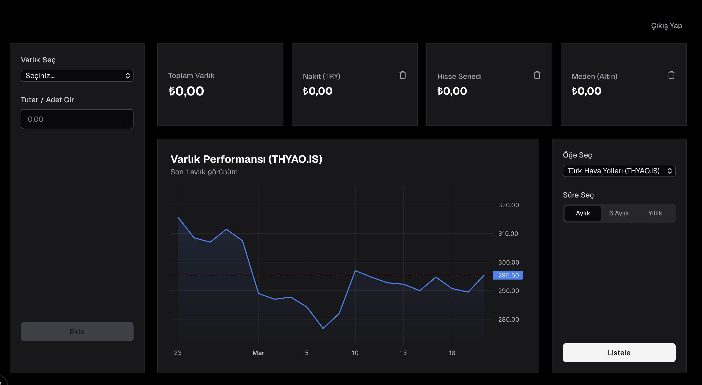

# Finans Takip Ön Yüzü (Next.js)

Bu depo, Next.js ile oluşturulmuş Finans ön yüzünü içermektedir.

## Gereksinimler

* Node.js (>=18)
* pnpm

## Önemli

Ön yüzü çalıştırmadan önce şunları başlatmalısınız:

1. docker-compose aracılığıyla PostgreSQL
2. Arka uç servisi

Arka uç deposu:
[https://github.com/hakanmartin/financenodejs]

---

## Kurulum

### 1. Ortam Değişkenlerini Yapılandırın

`.env.local` dosyasını oluşturun

```env
# Sadece 32 karakterlik rastgele karmaşık bir şifre üretip buraya yapıştır (terminalde 'openssl rand -hex 32' yazabilirsiniz)
AUTH0_SECRET=

# Next.js uygulamanın çalıştığı yerel adres
AUTH0_BASE_URL=http://localhost:3000

# Auth0 paneline girip Frontend uygulamanın ayarlarında bu bilgileri bulabilirsiniz:
AUTH0_AUDIENCE=
AUTH0_DOMAIN=
AUTH0_CLIENT_ID=
AUTH0_CLIENT_SECRET=
```
Auth0 da Nextjs için oluşturduğunuz projenin bilgilerini buraya girin.

---

### 2. Kurulum Bağımlılıklar

```bash
pnpm install
```

---

### 3. Ön Uç Çalıştırma

```bash
pnpm run dev
```

Uygulama şu adreste başlayacaktır:

```
http://localhost:3000
```

---

## Tam Yerel Geliştirme Akışı

1. Veritabanını Başlatma

```bash
docker compose up -d
```

2. Arka Uç Başlatma

```bash
npm run dev
```

3. Ön Uç Başlatma

```bash
pnpm run dev
```

---

## Dashboard Ekranı

Son olarak financefront uygulamasını da başarılı bir şekilde çalıştırp localhost:3000 adresinden Auth0 aracılığı ile kayıt olarak uygulamayı kullanmaya başlayabilirsiniz.


